# 1. Input
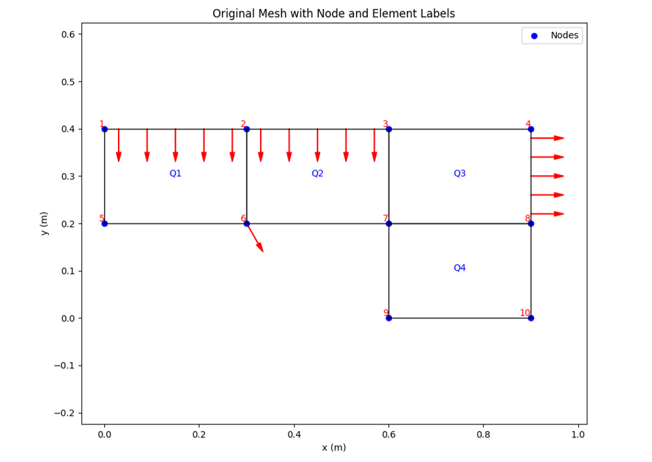

# 2. Full integration
Dưới đây là output từ chương trình python, sử dụng phương pháp full itegration 2x2 cho phần tử Quad4:
 ```shell
Processing: Element stiffness matrix, full integration.......
 
Full Integration Points (2x2 Quadrature):
GP0: (ξ=-0.5774, η=-0.5774), weight=(1.0000, 1.0000)
GP1: (ξ=0.5774, η=-0.5774), weight=(1.0000, 1.0000) 
GP2: (ξ=0.5774, η=0.5774), weight=(1.0000, 1.0000)
GP3: (ξ=-0.5774, η=0.5774), weight=(1.0000, 1.0000)

Element 1:
 [[ 8.6293e+10  3.9950e+10 -3.3558e+10  4.7940e+09 -4.3146e+10 -3.9950e+10 -9.588e+09 -4.794e+09]
 [ 3.9950e+10  1.3068e+11 -4.7940e+09  4.1903e+10 -3.9950e+10 -6.5341e+10  4.7940e+09 -1.072e+11]
 [-3.3558e+10 -4.7940e+09  8.6293e+10 -3.9950e+10 -9.5881e+09  4.7940e+09 -4.3146e+10  3.995e+10]
 [ 4.7940e+09  4.1903e+10 -3.9950e+10  1.3068e+11 -4.7940e+09 -1.0724e+11  3.9950e+10 -6.534e+10]
 [-4.3146e+10 -3.9950e+10 -9.5881e+09 -4.7940e+09  8.6293e+10  3.9950e+10 -3.3558e+10  4.794e+09]
 [-3.9950e+10 -6.5341e+10  4.7940e+09 -1.0724e+11  3.9950e+10  1.3068e+11 -4.7940e+09  4.190e+10]
 [-9.5881e+09  4.7940e+09 -4.3146e+10  3.9950e+10 -3.3558e+10 -4.7940e+09  8.6293e+10 -3.995e+10]
 [-4.7940e+09 -1.0724e+11  3.9950e+10 -6.5341e+10  4.7940e+09  4.1903e+10 -3.995e+10  1.306e+11]]
 
.
.
.

Reduced Global Stiffness Matrix (K):
 [[ 1.725e+11  0.000e+00 -3.356e+10 -4.794e+09  0.000e+00  0.000e+00 -1.918e+10  0.000e+00 -   4.315e+10  3.995e+10  0.000e+00  0.0000e+00]
 [ 0.0000e+00  2.6136e+11  4.7940e+09  4.1903e+10  0.0000e+00  0.0000e+00 -9.5367e-07 -2.1449e+11  3.9950e+10 -6.5341e+10  0.0000e+00  0.0000e+00]
 [-3.3558e+10  4.7940e+09  1.7259e+11  1.5259e-05 -3.3558e+10 -4.7940e+09 -4.3146e+10 -3.9950e+10 -1.9176e+10 -9.5367e-07 -4.3146e+10  3.9950e+10]
 [-4.7940e+09  4.1903e+10  1.5259e-05  2.6136e+11  4.7940e+09  4.1903e+10 -3.9950e+10 -6.5341e+10  1.9073e-06 -2.1449e+11  3.9950e+10 -6.5341e+10]
 [ 0.0000e+00  0.0000e+00 -3.3558e+10  4.7940e+09  8.6293e+10  3.9950e+10  0.0000e+00  0.0000e+00 -4.3146e+10 -3.9950e+10 -9.5881e+09 -4.7940e+09]
 [ 0.0000e+00  0.0000e+00 -4.7940e+09  4.1903e+10  3.9950e+10  1.3068e+11  0.0000e+00  0.0000e+00 -3.9950e+10 -6.5341e+10  4.7940e+09 -1.0724e+11]
 [-1.9176e+10  9.5367e-07 -4.3146e+10 -3.9950e+10  0.0000e+00  0.0000e+00  1.7259e+11  0.0000e+00 -3.3558e+10  4.7940e+09  0.0000e+00  0.0000e+00]
 [ 0.0000e+00 -2.1449e+11 -3.9950e+10 -6.5341e+10  0.0000e+00  0.0000e+00  0.0000e+00  2.6136e+11 -4.7940e+09  4.1903e+10  0.0000e+00  0.0000e+00]
 [-4.3146e+10  3.9950e+10 -1.9176e+10  1.9073e-06 -4.3146e+10 -3.9950e+10 -3.3558e+10 -4.7940e+09  2.5888e+11 -3.9950e+10 -6.7116e+10  0.0000e+00]
 [ 3.9950e+10 -6.5341e+10 -2.8610e-06 -2.1449e+11 -3.9950e+10 -6.5341e+10  4.7940e+09  4.1903e+10 -3.9950e+10  3.9205e+11  0.0000e+00  8.3807e+10]
 [ 0.0000e+00  0.0000e+00 -4.3146e+10  3.9950e+10 -9.5881e+09  4.7940e+09  0.0000e+00  0.0000e+00 -6.7116e+10  0.0000e+00  1.7259e+11  0.0000e+00]
 [ 0.0000e+00  0.0000e+00  3.9950e+10 -6.5341e+10 -4.7940e+09 -1.0724e+11  0.0000e+00  0.0000e+00  0.0000e+00  8.3807e+10  0.0000e+00  2.6136e+11]]

Reduced Force Vector (f):
 [0.   -90000.    0.   -45000.   15000.    0.   100000.    -173205.0808    0.   0.   15000.   0.]
Nodal Displacements (m):
Node 1: u_x = 0.000000e+00, 	u_y = 0.000000e+00
Node 2: u_x = 1.914727e-07, 	u_y = -3.641234e-06
Node 3: u_x = -6.464294e-07, 	u_y = -1.332487e-06
Node 4: u_x = -2.793274e-07, 	u_y = 3.119211e-07
Node 5: u_x = 0.000000e+00, 	u_y = 0.000000e+00
Node 6: u_x = 2.469188e-07, 	u_y = -3.929057e-06
Node 7: u_x = 4.686336e-07, 	u_y = -9.054158e-07
Node 8: u_x = 3.918161e-07, 	u_y = 1.788764e-07
Node 9: u_x = 0.000000e+00, 	u_y = 0.000000e+00
Node 10: u_x = 0.000000e+00, 	u_y = 0.000000e+00

Element Stresses (Pa):
Element 1:
  GP 1: σ_xx = 2.076257e+05,		σ_yy = 1.401420e+05, 	σ_xy = -9.107364e+05
  GP 2: σ_xx = 2.819796e+05,          	σ_yy = 3.313376e+05, 	σ_xy = -9.219905e+05
  GP 3: σ_xx = 2.574250e+05,      	σ_yy = 3.217886e+05, 	σ_xy = -8.830433e+05
  GP 4: σ_xx = 1.830712e+05,     	σ_yy = 1.305930e+05, 	σ_xy = -8.717891e+05
Element 2:
  GP 1: σ_xx = 5.949303e+04,        	σ_yy = 1.566795e+05, 	σ_xy = 5.750418e+05
  GP 2: σ_xx = -1.251868e+05,    	σ_yy = -3.182115e+05, 	σ_xy = 3.599664e+05
  GP 3: σ_xx = -5.944423e+05,     	σ_yy = -5.006997e+05, 	σ_xy = 2.632294e+05
  GP 4: σ_xx = -4.097624e+05,     	σ_yy = -2.580875e+04, 	σ_xy = 4.783048e+05
Element 3:
  GP 1: σ_xx = -1.250930e+05,    	σ_yy = -3.501170e+05, 	σ_xy = -7.716069e+04
  GP 2: σ_xx = 1.960264e+04,       	σ_yy = 2.195744e+04, 	σ_xy = 1.294374e+04
  GP 3: σ_xx = 2.161941e+05,     	σ_yy = 9.840968e+04, 	σ_xy = 8.873668e+04
  GP 4: σ_xx = 7.149850e+04,     	σ_yy = -2.736648e+05, 	σ_xy = -1.367745e+03
Element 4:
  GP 1: σ_xx = -3.150477e+05,   	σ_yy = -7.829462e+05, 	σ_xy = 2.127511e+05
  GP 2: σ_xx = -3.494096e+04,     	σ_yy = -6.267167e+04, 	σ_xy = 1.971591e+05
  GP 3: σ_xx = -6.895988e+04,     	σ_yy = -7.590125e+04, 	σ_xy = 3.438817e+05
  GP 4: σ_xx = -3.490667e+05,    	σ_yy = -7.961758e+05, 	σ_xy = 3.594737e+05

Element Strain:
Element 1:
  GP 1: σ_xx = 7.840054e-07,    	σ_yy = 3.041212e-07, 	σ_xy = -1.295269e-05
  GP 2: σ_xx = 7.840054e-07,   	σ_yy = 1.134996e-06, 	σ_xy = -1.311275e-05
  GP 3: σ_xx = 6.772993e-07,    	σ_yy = 1.134996e-06, 	σ_xy = -1.255884e-05
  GP 4: σ_xx = 6.772993e-07,    	σ_yy = 3.041212e-07, 	σ_xy = -1.239878e-05
Element 2:
  GP 1: σ_xx = -7.361933e-09, 	σ_yy = 6.837417e-07, 	σ_xy = 8.178373e-06
  GP 2: σ_xx = -7.361933e-09, 	σ_yy = -1.379982e-06, 	σ_xy = 5.119522e-06
  GP 3: σ_xx = -2.046596e-06, 	σ_yy = -1.379982e-06, 	σ_xy = 3.743706e-06
  GP 4: σ_xx = -2.046596e-06, 	σ_yy = 6.837417e-07, 	σ_xy = 6.802557e-06
Element 3:
  GP 1: σ_xx = 5.664583e-08, 		σ_yy = -1.543525e-06, 	σ_xy = -1.097396e-06
  GP 2: σ_xx = 5.664583e-08, 		σ_yy = 7.339104e-08, 	σ_xy = 1.840887e-07
  GP 3: σ_xx = 9.109693e-07, 		σ_yy = 7.339104e-08, 	σ_xy = 1.262033e-06
  GP 4: σ_xx = 9.109693e-07, 		σ_yy = -1.543525e-06, 	σ_xy = -1.945237e-08
Element 4:
  GP 1: σ_xx = -5.411148e-08,  	σ_yy = -3.381390e-06, 	σ_xy = 3.025794e-06
  GP 2: σ_xx = -5.411148e-08, 	σ_yy = -2.513076e-07, 	σ_xy = 2.804041e-06
  GP 3: σ_xx = -2.019468e-07, 	σ_yy = -2.513076e-07, 	σ_xy = 4.890762e-06
  GP 4: σ_xx = -2.019468e-07, 	σ_yy = -3.381390e-06, 	σ_xy = 5.112515e-06
Element 1 mean stress: σ_xx = 2.325254e+05,  σ_yy = 2.309653e+05,  σ_xy = -8.968898e+05
Element 2 mean stress: σ_xx = -2.674746e+05, σ_yy = -1.720101e+05, σ_xy = 4.191356e+05
Element 3 mean stress: σ_xx = 4.555057e+04,  σ_yy = -1.258537e+05, σ_xy = 5.787997e+03
Element 4 mean stress: σ_xx = -1.920038e+05, σ_yy = -4.294237e+05, σ_xy = 2.783164e+05
Element 1 mean strain: ε_xx = 7.306524e-07,  ε_yy = 7.195585e-07,  ε_xy = -1.275577e-05
Element 2 mean strain: ε_xx = -1.026979e-06, ε_yy = -3.481202e-07, ε_xy = 5.961040e-06
Element 3 mean strain: ε_xx = 4.838076e-07,  ε_yy = -7.350670e-07, ε_xy = 8.231818e-08
Element 4 mean strain: ε_xx = -1.280291e-07, ε_yy = -1.816349e-06, ε_xy = 3.958278e-06

Eigenfrequencies (Hz):
Mode 1: f = 1698.533425 Hz
Mode 2: f = 2213.226430 Hz
Mode 3: f = 3314.380085 Hz
Mode 4: f = 4741.907669 Hz
Mode Shapes:
Mode 1: [ 0.      0.      0.0126  0.0213  0.0335  0.0162  0.0408 -0.0125  0.      0.      0.0192  0.0265  0.019   0.0153  0.0175 -0.0106  0.      0.      0.      0.    ]
Mode 2: [ 0.      0.     -0.0128  0.0385 -0.0129  0.0208 -0.0199  0.0098  0.      0.     -0.0058  0.0371 -0.0179  0.0139 -0.0206  0.0079  0.      0.      0.      0.    ]
Mode 3: [ 0.      0.      0.0028 -0.0257 -0.0076  0.0268 -0.0115  0.0561  0.      0.      0.0124 -0.0235  0.0195  0.0224 -0.0016  0.0344  0.      0.      0.      0.    ]
Mode 4: [ 0.      0.     -0.0449 -0.0166 -0.0066  0.0266  0.0593 -0.0365  0.      0.     -0.0305 -0.0186 -0.0008  0.0326  0.0076 -0.0201  0.     0.      0.      0.    ]
```


 
Hình 2.2 Ứng suất phương XX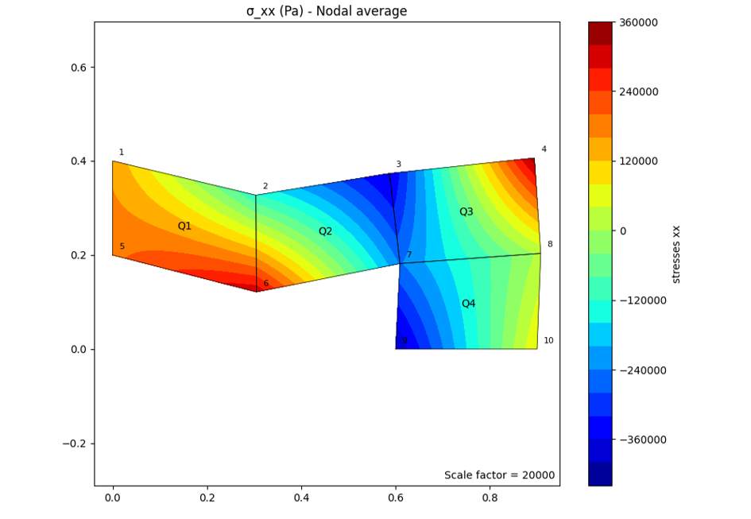
 
Hình 2.3 Ứng suất chương YY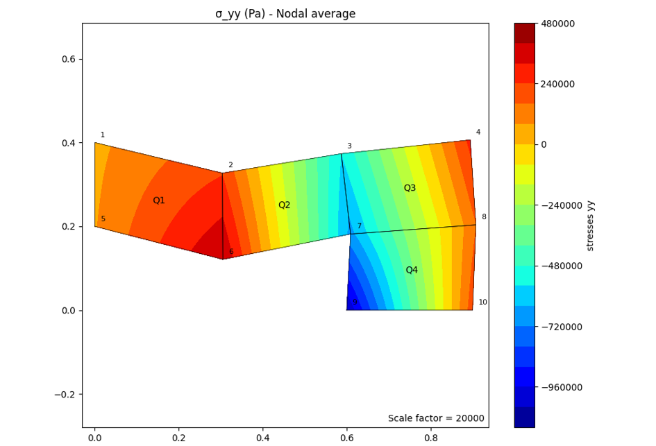
 
Hình 2.4 Ứng suất phương XY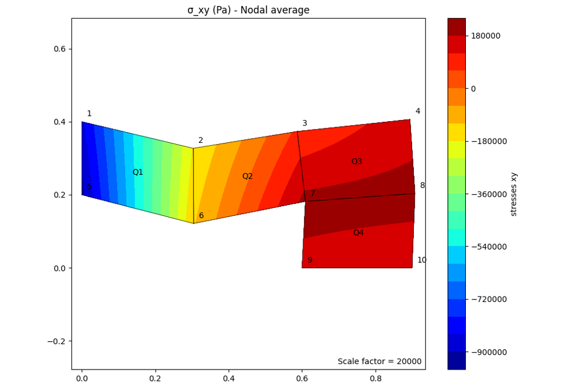
 
Hình 2.5 Biến dạng phương XX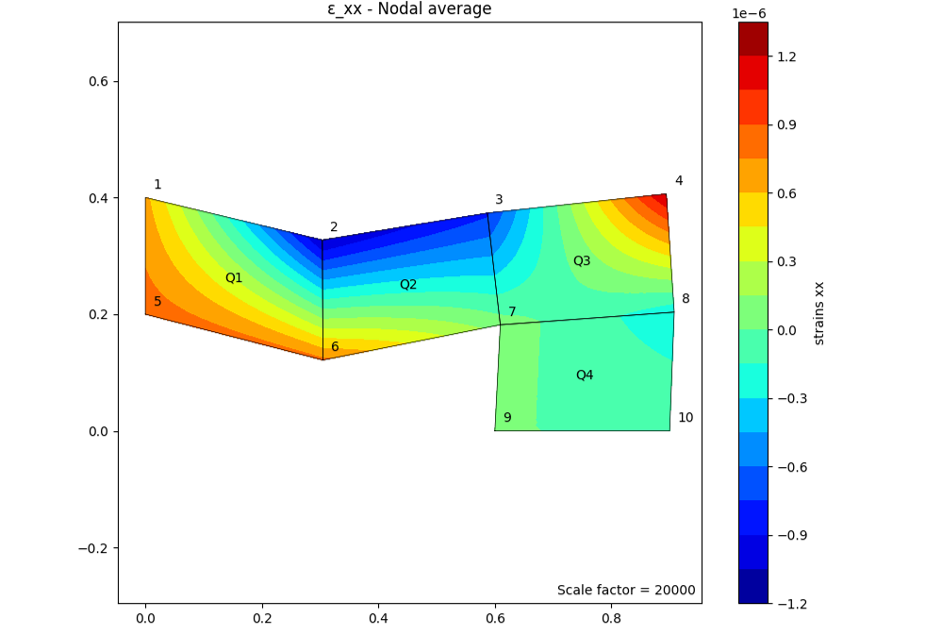
 
Hình 2.6 Biến dạng phương YY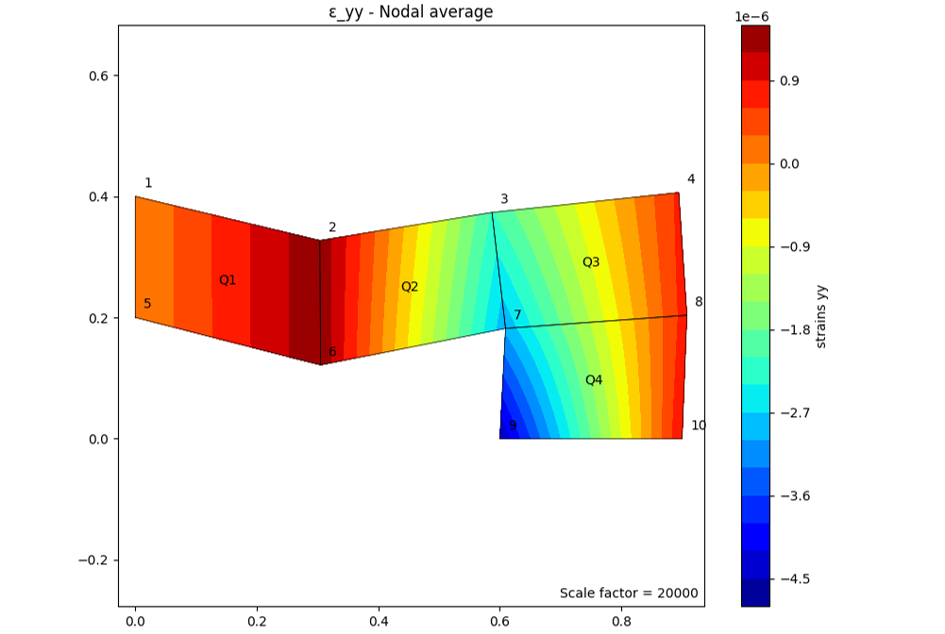
  
Hình 2.7 Biến dạng phương XY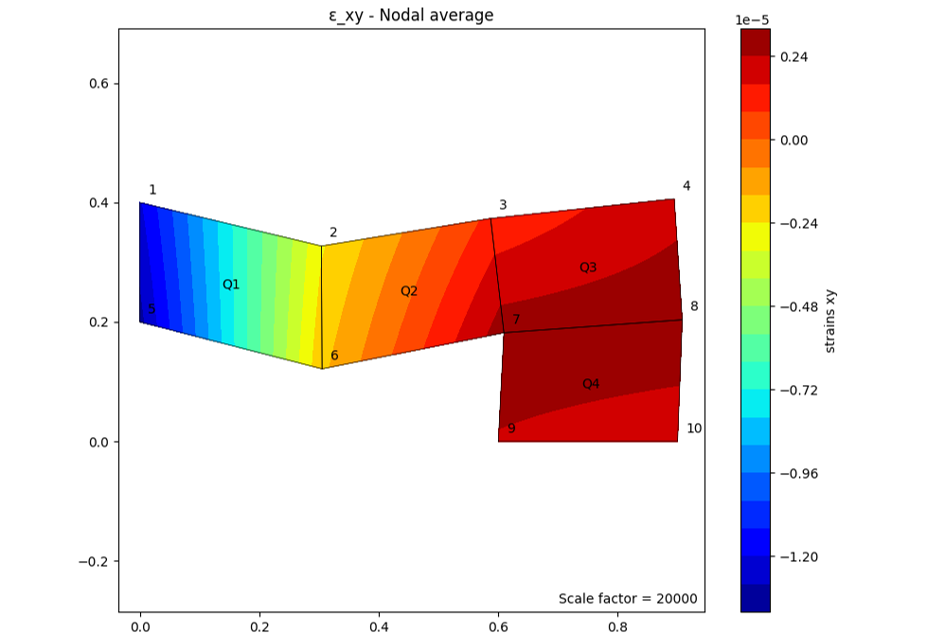
 
Hình 2.8 4 mode shape đầu tiên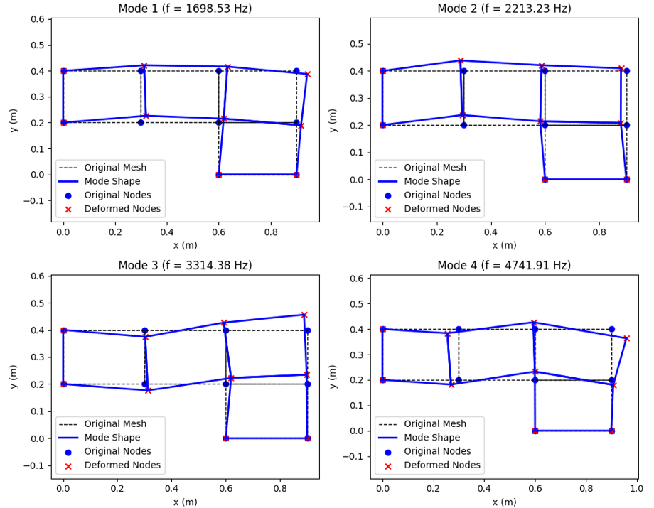
 
# 3. So sánh kết quả với ANSYS và các đánh giá
 
 
Hình 3.1 Lưới và các điều kiện biện định nghĩa trong ANSYS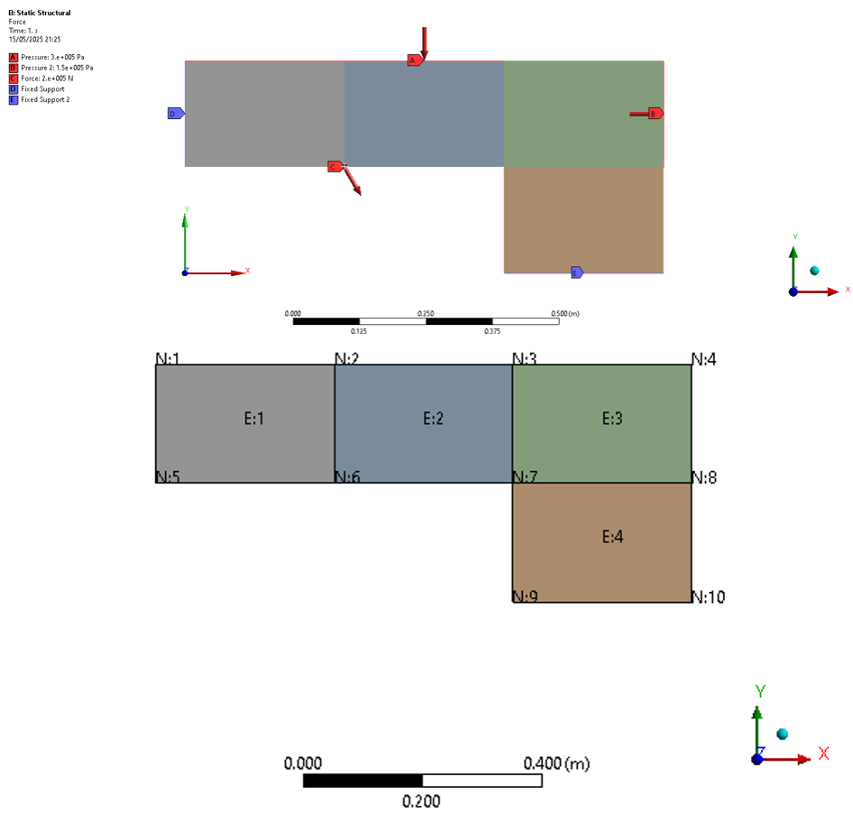

```shell
Output từ ANSYS:
--- GLOBAL REDUCED STIFFNESS MATRIX ---
KMATRIXF: 
[ 1, 1]: 1.511e+11 [ 1, 2]: 0.000e+00 [ 1, 3]: 2.269e+09 [ 1, 4]: 0.000e+00 [ 1, 5]:-5.387e+10 [ 1, 6]: 3.995e+10 [ 1, 7]:-2.284e+10 [ 1, 8]:-4.794e+09 [ 1, 9]: 0.000e+00 [ 1,10]: 0.000e+00 [ 1,11]: 0.000e+00 [ 1,12]: 0.000e+00 

[ 2, 1]: 0.000e+00 [ 2, 2]: 2.449e+11 [ 2, 3]: 0.000e+00 [ 2, 4]:-1.980e+11 [ 2, 5]: 3.995e+10 [ 2, 6]:-7.360e+10 [ 2, 7]: 4.794e+09 [ 2, 8]: 5.016e+10 [ 2, 9]: 0.000e+00 [ 2,10]: 0.000e+00 [ 2,11]: 0.000e+00 [ 2,12]: 0.000e+00 

[ 3, 1]: 2.269e+09 [ 3, 2]: 0.000e+00 [ 3, 3]: 1.511e+11 [ 3, 4]: 0.000e+00 [ 3, 5]:-2.284e+10 [ 3, 6]: 4.794e+09 [ 3, 7]:-5.387e+10 [ 3, 8]:-3.995e+10 [ 3, 9]: 0.000e+00 [ 3,10]: 0.000e+00 [ 3,11]: 0.000e+00 [ 3,12]: 0.000e+00 

[ 4, 1]: 0.000e+00 [ 4, 2]:-1.980e+11 [ 4, 3]: 0.000e+00 [ 4, 4]: 2.449e+11 [ 4, 5]:-4.794e+09 [ 4, 6]: 5.016e+10 [ 4, 7]:-3.995e+10 [ 4, 8]:-7.360e+10 [ 4, 9]: 0.000e+00 [ 4,10]: 0.000e+00 [ 4,11]: 0.000e+00 [ 4,12]: 0.000e+00 

[ 5, 1]:-5.387e+10 [ 5, 2]: 3.995e+10 [ 5, 3]:-2.284e+10 [ 5, 4]:-4.794e+09 [ 5, 5]: 2.267e+11 [ 5, 6]:-3.995e+10 [ 5, 7]: 2.269e+09 [ 5, 8]: 0.000e+00 [ 5, 9]:-4.567e+10 [ 5,10]: 0.000e+00 [ 5,11]:-5.387e+10 [ 5,12]:-3.995e+10 

[ 6, 1]: 3.995e+10 [ 6, 2]:-7.360e+10 [ 6, 3]: 4.794e+09 [ 6, 4]: 5.016e+10 [ 6, 5]:-3.995e+10 [ 6, 6]: 3.673e+11 [ 6, 7]: 0.000e+00 [ 6, 8]:-1.980e+11 [ 6, 9]: 0.000e+00 [ 6,10]: 1.003e+11 [ 6,11]:-3.995e+10 [ 6,12]:-7.360e+10 

[ 7, 1]:-2.284e+10 [ 7, 2]: 4.794e+09 [ 7, 3]:-5.387e+10 [ 7, 4]:-3.995e+10 [ 7, 5]: 2.269e+09 [ 7, 6]: 0.000e+00 [ 7, 7]: 1.511e+11 [ 7, 8]: 0.000e+00 [ 7, 9]:-5.387e+10 [ 7,10]: 3.995e+10 [ 7,11]:-2.284e+10 [ 7,12]:-4.794e+09 

[ 8, 1]:-4.794e+09 [ 8, 2]: 5.016e+10 [ 8, 3]:-3.995e+10 [ 8, 4]:-7.360e+10 [ 8, 5]: 0.000e+00 [ 8, 6]:-1.980e+11 [ 8, 7]: 0.000e+00 [ 8, 8]: 2.449e+11 [ 8, 9]: 3.995e+10 [ 8,10]:-7.360e+10 [ 8,11]: 4.794e+09 [ 8,12]: 5.016e+10 

[ 9, 1]: 0.000e+00 [ 9, 2]: 0.000e+00 [ 9, 3]: 0.000e+00 [ 9, 4]: 0.000e+00 [ 9, 5]:-4.567e+10 [ 9, 6]: 0.000e+00 [ 9, 7]:-5.387e+10 [ 9, 8]: 3.995e+10 [ 9, 9]: 1.511e+11 [ 9,10]: 0.000e+00 [ 9,11]: 1.134e+09 [ 9,12]: 4.794e+09 

[10, 1]: 0.000e+00 [10, 2]: 0.000e+00 [10, 3]: 0.000e+00 [10, 4]: 0.000e+00 [10, 5]: 0.000e+00 [10, 6]: 1.003e+11 [10, 7]: 3.995e+10 [10, 8]:-7.360e+10 [10, 9]: 0.000e+00 [10,10]: 2.449e+11 [10,11]:-4.794e+09 [10,12]:-9.899e+10 

[11, 1]: 0.000e+00 [11, 2]: 0.000e+00 [11, 3]: 0.000e+00 [11, 4]: 0.000e+00 [11, 5]:-5.387e+10 [11, 6]:-3.995e+10 [11, 7]:-2.284e+10 [11, 8]: 4.794e+09 [11, 9]: 1.134e+09 [11,10]:-4.794e+09 [11,11]: 7.557e+10 [11,12]: 3.995e+10 

[12, 1]: 0.000e+00 [12, 2]: 0.000e+00 [12, 3]: 0.000e+00 [12, 4]: 0.000e+00 [12, 5]:-3.995e+10 [12, 6]:-7.360e+10 [12, 7]:-4.794e+09 [12, 8]: 5.016e+10 [12, 9]: 4.794e+09 [12,10]:-9.899e+10 [12,11]: 3.995e+10 [12,12]: 1.224e+11

FMATRIXF: 
[ 1, 1]: 0.000e+00 [ 2, 1]:-9.000e+04 [ 3, 1]: 1.000e+05 [ 4, 1]:-1.732e+05 [ 5, 1]: 0.000e+00 
[ 6, 1]: 0.000e+00 [ 7, 1]: 0.000e+00 [ 8, 1]:-4.500e+04 [ 9, 1]: 1.500e+04 [10, 1]: 0.000e+00 
[11, 1]: 1.500e+04 [12, 1]: 0.000e+00
	Mode	Frequency [Hz]	
1	1.	1577.4	
2	2.	2189.4	
3	3.	3229.2	
4	4.	4487.5	
```

Hình 3.2 Các mode shape - ANSYS Program controlled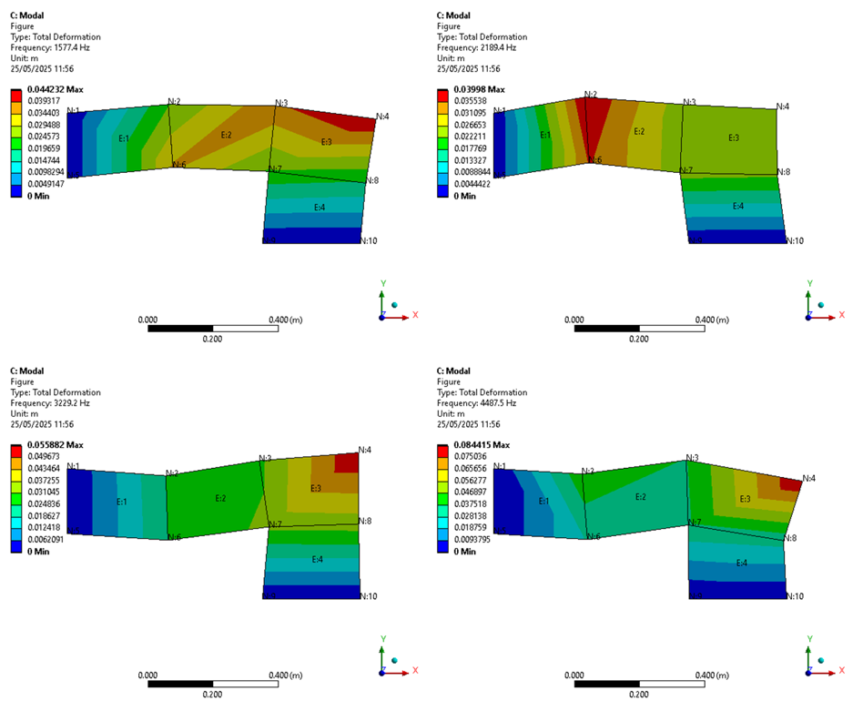

Các kết quả so sánh khác được trình bày chi tiết trong bảng so sánh giữa các phương pháp.

Dưới đây là ma trận độ cứng phần tử xuất từ ANSYS:
KMATRIXEBUFFER:

[1,1]: 7.557e+10 [1,2]: 3.995e+10 [1,3]:-2.284e+10 [1,4]: 4.794e+09 [1,5]:-5.387e+10 [1,6]:-3.995e+10 [1,7]: 1.134e+09 [1,8]:-4.794e+09

[2,1]: 3.995e+10 [2,2]: 1.224e+11 [2,3]:-4.794e+09 [2,4]: 5.016e+10 [2,5]:-3.995e+10 [2,6]:-7.360e+10 [2,7]: 4.794e+09 [2,8]:-9.899e+10

[3,1]:-2.284e+10 [3,2]:-4.794e+09 [3,3]: 7.557e+10 [3,4]:-3.995e+10 [3,5]: 1.134e+09 [3,6]: 4.794e+09 [3,7]:-5.387e+10 [3,8]: 3.995e+10

[4,1]: 4.794e+09 [4,2]: 5.016e+10 [4,3]:-3.995e+10 [4,4]: 1.224e+11 [4,5]:-4.794e+09 [4,6]:-9.899e+10 [4,7]: 3.995e+10 [4,8]:-7.360e+10
 
[5,1]:-5.387e+10 [5,2]:-3.995e+10 [5,3]: 1.134e+09 [5,4]:-4.794e+09 [5,5]: 7.557e+10 [5,6]: 3.995e+10 [5,7]:-2.284e+10 [5,8]: 4.794e+09
 
[6,1]:-3.995e+10 [6,2]:-7.360e+10 [6,3]: 4.794e+09 [6,4]:-9.899e+10 [6,5]: 3.995e+10 [6,6]: 1.224e+11 [6,7]:-4.794e+09 [6,8]: 5.016e+10
 
[7,1]: 1.134e+09 [7,2]: 4.794e+09 [7,3]:-5.387e+10 [7,4]: 3.995e+10 [7,5]:-2.284e+10 [7,6]:-4.794e+09 [7,7]: 7.557e+10 [7,8]:-3.995e+10
 
[8,1]:-4.794e+09 [8,2]:-9.899e+10 [8,3]: 3.995e+10 [8,4]:-7.360e+10 [8,5]: 4.794e+09 [8,6]: 5.016e+10 [8,7]:-3.995e+10 [8,8]: 1.224e+11
FMATRIXF: 
[ 1, 1]: 0.000e+00 [ 2, 1]:-9.000e+04 [ 3, 1]: 1.000e+05 [ 4, 1]:-1.732e+05 [ 5, 1]: 0.000e+00 
[ 6, 1]: 0.000e+00 [ 7, 1]: 0.000e+00 [ 8, 1]:-4.500e+04 [ 9, 1]: 1.500e+04 [10, 1]: 0.000e+00 
[11, 1]: 1.500e+04 [12, 1]: 0.000e+00

Từ các output trên có thể thấy được, ma trận độ cứng của ANSYS và python output là khác nhau. Từ đó dẫn đến các kết quả dẫn đến các kết quả tính toán khác nhau giữa phần mềm và code, nguyên nhân chính là bởi ANSYS không dùng full integration như python, mà sử dụng một số phương pháp hiệu chỉnh, như B-Bar, Simplified enhace strain formulation, etc, nhằm mục đích loại bỏ sự ảnh hưởng của volume locking và, hoặc, shear locking đối với các phần tử bậc thấp tuyến tính như Q4.
Cụ thể trong bài toán này, phần tử được sử dụng là PLANE182, và chương trình tự động lựa chọn phương án Simplified enhanced strain formulation.

```shell
*** SELECTION OF ELEMENT TECHNOLOGIES FOR APPLICABLE ELEMENTS ***
--- GIVE SUGGESTIONS AND RESET THE KEY OPTIONS ---

ELEMENT TYPE 1 IS PLANE182 WITH PLANE STRAIN OPTION. IT IS ASSOCIATED WITH LINEAR MATERIALS ONLY AND POISSON'S RATIO IS NOT GREATER THAN 0.49. KEYOPT(1)=3 IS SUGGESTED AND HAS BEEN RESET.
KEYOPT(1-12)= 3 0 2 0 0 0 0 0 0 0 0 0

ELEMENT TYPE 2 IS PLANE182 WITH PLANE STRAIN OPTION. IT IS ASSOCIATED WITH
LINEAR MATERIALS ONLY AND POISSON'S RATIO IS NOT GREATER THAN 0.49. KEYOPT(1)=3 IS SUGGESTED AND HAS BEEN RESET.
KEYOPT(1-12)= 3 0 2 0 0 0 0 0 0 0 0 0 

ELEMENT TYPE 3 IS PLANE182 WITH PLANE STRAIN OPTION. IT IS ASSOCIATED WITH LINEAR MATERIALS ONLY AND POISSON'S RATIO IS NOT GREATER THAN 0.49. KEYOPT(1)=3 IS SUGGESTED AND HAS BEEN RESET.
KEYOPT(1-12)= 3 0 2 0 0 0 0 0 0 0 0 0

ELEMENT TYPE 4 IS PLANE182 WITH PLANE STRAIN OPTION. IT IS ASSOCIATED WITH LINEAR MATERIALS ONLY AND POISSON'S RATIO IS NOT GREATER THAN 0.49. KEYOPT(1)=3 IS SUGGESTED AND HAS BEEN RESET.
KEYOPT(1-12)= 3 0 2 0 0 0 0 0 0 0 0 0
```

Vì vậy, code python sau đây được thêm vào các hàm nhằm thực hiện các kỹ thuật B-Bar, Selective reduced integration và Incompatible strain nhằm so sánh với kết quả xuất ra từ ANSYS.

Kết quả ma trận độ cứng phần tử tạo bởi code cho thấy sự trùng khớp với ma trận độ cứng phần tử KMATRIXEBUFFER từ ANSYS:
```shell
Element 1:
 [[ 7.5570e+10  3.9950e+10 -2.2836e+10  4.7940e+09 -5.3869e+10 -3.9950e+10  1.134e+09 -4.794e+09]
 [ 3.9950e+10  1.2243e+11 -4.7940e+09  5.0160e+10 -3.9950e+10 -7.3597e+10  4.7940e+09 -9.898e+10]
 [-2.2836e+10 -4.7940e+09  7.5570e+10 -3.9950e+10  1.1344e+09  4.7940e+09 -5.3869e+10  3.995e+10]
 [ 4.7940e+09  5.0160e+10 -3.9950e+10  1.2243e+11 -4.7940e+09 -9.8988e+10  3.9950e+10 -7.360e+10]
 [-5.3869e+10 -3.9950e+10  1.1344e+09 -4.7940e+09  7.5570e+10  3.9950e+10 -2.2836e+10  4.794e+09]
 [-3.9950e+10 -7.3597e+10  4.7940e+09 -9.8988e+10  3.9950e+10  1.2243e+11 -4.7940e+09  5.016e+10]
 [ 1.1344e+09  4.7940e+09 -5.3869e+10  3.9950e+10 -2.2836e+10 -4.7940e+09  7.5570e+10 -3.995e+10]
 [-4.7940e+09 -9.8988e+10  3.9950e+10 -7.3597e+10  4.7940e+09  5.0160e+10 -3.995e+10  1.224e+11]]
```

# 4. Các kết quả của các phương pháp được so sánh dựa trên displacement, stress và strain. 

Bảng 3.1 So sánh displacement giữa ANSYS và các phương pháp sử dụng trong python code
Directional Deformation (m)	 	 	 	 	 	 
Nodal original coordinates	ANSYS - Program Control	ANSYS - Manual Control	Code - Full intergration
Node	X	Y	X	Y	X	Y	X	Y
1	0	0.4	0.000E+00	0.000E+00	0.000E+00	0.000E+00	0.000E+00	0.000E+00
2	0.3	0.4	2.630E-07	-3.820E-06	2.107E-07	-3.885E-06	1.915E-07	-3.641E-06
3	0.6	0.4	-9.740E-07	-1.530E-06	-1.139E-06	-1.863E-06	-6.464E-07	-1.332E-06
4	0.9	0.4	-4.230E-07	5.440E-07	-7.840E-07	9.065E-07	-2.793E-07	3.119E-07
5	0	0.2	0.000E+00	0.000E+00	0.000E+00	0.000E+00	0.000E+00	0.000E+00
6	0.3	0.2	2.020E-08	-4.200E-06	-1.077E-07	-4.434E-06	2.469E-07	-3.929E-06
7	0.6	0.2	5.370E-07	-1.010E-06	4.518E-07	-1.159E-06	4.686E-07	-9.054E-07
8	0.9	0.2	3.040E-07	3.260E-07	3.074E-07	4.757E-07	3.918E-07	1.789E-07
9	0.6	0	0.000E+00	0.000E+00	0.000E+00	0.000E+00	0.000E+00	0.000E+00
10	0.9	0	0.000E+00	0.000E+00	0.000E+00	0.000E+00	0.000E+00	0.000E+00
 	RMS :	 	0.000E+00	0.000E+00	4.288E-07	5.885E-07	4.437E-07	4.804E-07

Directional Deformation (m) (cont’)
Nodal original coordinates	Code - Selective Reduced	Code - Bbar	Code - Incompatible
Node	X	Y	X	Y	X	Y	X	Y
1	0	0.4	0.000E+00	0.000E+00	0.000E+00	0.000E+00	0.000E+00	0.000E+00
2	0.3	0.4	2.107E-07	-3.885E-06	2.107E-07	-3.885E-06	2.632E-07	-3.821E-06
3	0.6	0.4	-1.139E-06	-1.863E-06	-1.139E-06	-1.863E-06	-9.736E-07	-1.527E-06
4	0.9	0.4	-7.840E-07	9.065E-07	-7.840E-07	9.065E-07	-4.225E-07	5.442E-07
5	0	0.2	0.000E+00	0.000E+00	0.000E+00	0.000E+00	0.000E+00	0.000E+00
6	0.3	0.2	-1.077E-07	-4.434E-06	-1.077E-07	-4.434E-06	2.024E-08	-4.197E-06
7	0.6	0.2	4.518E-07	-1.159E-06	4.518E-07	-1.159E-06	5.373E-07	-1.012E-06
8	0.9	0.2	3.074E-07	4.757E-07	3.074E-07	4.757E-07	3.042E-07	3.263E-07
9	0.6	0	0.000E+00	0.000E+00	0.000E+00	0.000E+00	0.000E+00	0.000E+00
10	0.9	0	0.000E+00	0.000E+00	0.000E+00	0.000E+00	0.000E+00	0.000E+00
 	RMS :	 	4.288E-07	5.885E-07	4.288E-07	5.885E-07	7.605E-10	4.736E-09

Bởi vì bản chất B-Bar và Selective reduced integration có phần giống nhau, đồng thời kết quả cho ra tương tự nhau, nên các so sánh sẽ chỉ sử dụng B-Bar thay cho cả hai phương pháp.
ANSYS – Manual Control là phương án “ép’ ANSYS sử dụng phương pháp khác ngoài phương pháp tự động sử dụng bởi chương trình, ở đây là B-Bar integration. (ANSYS và các phần mềm FEM thương mại, khi nhắc đến full integration đều là B-Bar, không phải thực sự là full integration). Xem thêm phụ lục để biết các setting đã dùng trong ANSYS.

```shell
--- ANSYS OUTPUT – MANUAL CONTROL – KEYOPT(1) = 0 -----------------------------------------------

KMATRIXEBUFFER:

[1,1]: 7.741e+10 [1,2]: 3.995e+10 [1,3]:-2.468e+10 [1,4]: 4.794e+09 [1,5]:-5.202e+10 [1,6]:-3.995e+10 [1,7]:-7.102e+08 [1,8]:-4.794e+09 

[2,1]: 3.995e+10 [2,2]: 1.107e+11 [2,3]:-4.794e+09 [2,4]: 6.188e+10 [2,5]:-3.995e+10 [2,6]:-8.532e+10 [2,7]: 4.794e+09 [2,8]:-8.727e+10 

[3,1]:-2.468e+10 [3,2]:-4.794e+09 [3,3]: 7.741e+10 [3,4]:-3.995e+10 [3,5]:-7.102e+08 [3,6]: 4.794e+09 [3,7]:-5.202e+10 [3,8]: 3.995e+10 

[4,1]: 4.794e+09 [4,2]: 6.188e+10 [4,3]:-3.995e+10 [4,4]: 1.107e+11 [4,5]:-4.794e+09 [4,6]:-8.727e+10 [4,7]: 3.995e+10 [4,8]:-8.532e+10 

[5,1]:-5.202e+10 [5,2]:-3.995e+10 [5,3]:-7.102e+08 [5,4]:-4.794e+09 [5,5]: 7.741e+10 [5,6]: 3.995e+10 [5,7]:-2.468e+10 [5,8]: 4.794e+09 

[6,1]:-3.995e+10 [6,2]:-8.532e+10 [6,3]: 4.794e+09 [6,4]:-8.727e+10 [6,5]: 3.995e+10 [6,6]: 1.107e+11 [6,7]:-4.794e+09 [6,8]: 6.188e+10 

[7,1]:-7.102e+08 [7,2]: 4.794e+09 [7,3]:-5.202e+10 [7,4]: 3.995e+10 [7,5]:-2.468e+10 [7,6]:-4.794e+09 [7,7]: 7.741e+10 [7,8]:-3.995e+10 

[8,1]:-4.794e+09 [8,2]:-8.727e+10 [8,3]: 3.995e+10 [8,4]:-8.532e+10 [8,5]: 4.794e+09 [8,6]: 6.188e+10 [8,7]:-3.995e+10 [8,8]: 1.107e+11
```

```shell
--- PYTHON OUTPUT B-BAR INTEGRATION -------------------------------------------------------------

Element 1:
 [[ 7.7415e+10  3.9950e+10 -2.4680e+10  4.7940e+09 -5.2024e+10 -3.9950e+10 -7.102e+08 -4.794e+09]
 [ 3.9950e+10  1.1071e+11 -4.7940e+09  6.1879e+10 -3.9950e+10 -8.5316e+10  4.794e+09 -8.7269e+10]
 [-2.4680e+10 -4.7940e+09  7.7415e+10 -3.9950e+10 -7.1023e+08  4.7940e+09 -5.2024e+10  3.995e+10]
 [ 4.7940e+09  6.1879e+10 -3.9950e+10  1.1071e+11 -4.7940e+09 -8.7269e+10  3.9950e+10 -8.532e+10]
 [-5.2024e+10 -3.9950e+10 -7.1023e+08 -4.7940e+09  7.7415e+10  3.9950e+10 -2.4680e+10  4.794e+09]
 [-3.9950e+10 -8.5316e+10  4.7940e+09 -8.7269e+10  3.9950e+10  1.1071e+11 -4.7940e+09  6.188e+10]
 [-7.1023e+08  4.7940e+09 -5.2024e+10  3.9950e+10 -2.4680e+10 -4.7940e+09  7.7415e+10 -3.995e+10]
 [-4.7940e+09 -8.7269e+10  3.9950e+10 -8.5316e+10  4.7940e+09  6.1879e+10 -3.995e+10  1.107e+11]]
```

Quan sát bảng so sánh displacement và ma trận độ cứng phần tử của 2 phương pháp cho thấy sự trùng khớp giữa hai kết quả, cho thấy phương pháp sử dụng bởi ANSYS tương đương với phương pháp đề cập trong code python.

Bảng 3.2 So sánh stress giữa ANSYS và các phương pháp sử dụng trong python code
Integration point results - stresses	 	 	 	 
Points	 	ANSYS - Program Control	 	Code - Full intergration	 
Element	Point	Stress X	Stress Y	Stress XY	Stress X	Stress Y	Stress XY
1	1	1.472E+05	1.526E+05	-8.969E+05	2.076E+05	1.401E+05	-9.107E+05
1	2	1.472E+05	3.645E+05	-8.969E+05	2.820E+05	3.313E+05	-9.220E+05
1	3	2.385E+05	3.645E+05	-8.969E+05	2.574E+05	3.218E+05	-8.830E+05
1	4	2.385E+05	1.526E+05	-8.969E+05	1.831E+05	1.306E+05	-8.718E+05
2	1	2.246E+04	6.378E+04	4.191E+05	5.949E+04	1.567E+05	5.750E+05
2	2	2.246E+04	-4.386E+05	4.191E+05	-1.252E+05	-3.182E+05	3.600E+05
2	3	-6.368E+05	-4.386E+05	4.191E+05	-5.944E+05	-5.007E+05	2.632E+05
2	4	-6.368E+05	6.378E+04	4.191E+05	-4.098E+05	-2.581E+04	4.783E+05
3	1	-9.189E+04	-3.302E+05	6.273E+03	-1.251E+05	-3.501E+05	-7.716E+04
3	2	-9.189E+04	8.316E+04	6.273E+03	1.960E+04	2.196E+04	1.294E+04
3	3	2.029E+05	8.316E+04	6.273E+03	2.162E+05	9.841E+04	8.874E+04
3	4	2.029E+05	-3.302E+05	6.273E+03	7.150E+04	-2.737E+05	-1.368E+03
4	1	-1.991E+05	-8.068E+05	3.048E+05	-3.150E+05	-7.829E+05	2.128E+05
4	2	-1.991E+05	-5.207E+04	3.048E+05	-3.494E+04	-6.267E+04	1.972E+05
4	3	-2.867E+05	-5.207E+04	3.048E+05	-6.896E+04	-7.590E+04	3.439E+05
4	4	-2.867E+05	-8.068E+05	3.048E+05	-3.491E+05	-7.962E+05	3.595E+05
 	RMS :	0.000E+00	0.000E+00	0.000E+00	4.738E+05	2.179E+05	3.093E+05

 Integration point results – stresses (cont’)
Points	 	Code - Bbar	 	 	Code - Incompatible	 
Element	Point	Stress X	Stress Y	Stress XY	Stress X	Stress Y	Stress XY
1	1	1.967E+05	2.973E+05	-9.884E+05	1.472E+05	1.526E+05	-8.969E+05
1	2	8.513E+04	4.088E+05	-9.238E+05	1.472E+05	3.645E+05	-8.969E+05
1	3	1.282E+05	3.657E+05	-8.494E+05	2.385E+05	3.645E+05	-8.969E+05
1	4	2.398E+05	2.542E+05	-9.141E+05	2.385E+05	1.526E+05	-8.969E+05
2	1	-3.357E+05	-2.087E+05	6.757E+05	2.246E+04	6.378E+04	4.191E+05
2	2	-8.116E+04	-4.632E+05	2.882E+05	2.246E+04	-4.386E+05	4.191E+05
2	3	-3.395E+05	-2.049E+05	1.185E+05	-6.368E+05	-4.386E+05	4.191E+05
2	4	-5.940E+05	4.960E+04	5.060E+05	-6.368E+05	6.378E+04	4.191E+05
3	1	1.010E+05	-2.073E+05	-8.269E+04	-9.189E+04	-3.301E+05	6.273E+03
3	2	-1.294E+05	2.306E+04	1.860E+04	-9.189E+04	8.316E+04	6.273E+03
3	3	-6.192E+04	-4.447E+04	1.722E+05	2.029E+05	8.316E+04	6.273E+03
3	4	1.685E+05	-2.749E+05	7.091E+04	2.029E+05	-3.301E+05	6.273E+03
4	1	-3.259E+04	-5.904E+05	2.291E+05	-1.991E+05	-8.068E+05	3.048E+05
4	2	-3.644E+05	-2.586E+05	1.998E+05	-1.991E+05	-5.207E+04	3.048E+05
4	3	-3.839E+05	-2.390E+05	4.210E+05	-2.867E+05	-5.207E+04	3.048E+05
4	4	-5.212E+04	-5.709E+05	4.503E+05	-2.867E+05	-8.068E+05	3.048E+05
 	RMS :	6.908E+05	6.172E+05	5.326E+05	1.353E+01	9.500E+00	9.710E+00


Bảng 3.3 So sánh strain giữa ANSYS và các phương pháp sử dụng trong python code
Integration point results - strains	 	 	 	 	 
Points	 	ANSYS - Program Control	 	Code - Full intergration	 
Element	Point	Strain X	Strain Y	Strain XY	Strain X	Strain Y	Strain XY
1	1	4.497E-07	4.881E-07	-1.276E-05	7.840E-07	3.041E-07	-1.295E-05
1	2	2.762E-08	1.573E-06	-1.276E-05	7.840E-07	1.135E-06	-1.311E-05
1	3	4.952E-07	1.392E-06	-1.276E-05	6.773E-07	1.135E-06	-1.256E-05
1	4	9.173E-07	3.063E-07	-1.276E-05	6.773E-07	3.041E-07	-1.240E-05
2	1	-1.202E-08	2.819E-07	5.961E-06	-7.362E-09	6.837E-07	8.178E-06
2	2	9.883E-07	-2.290E-06	5.961E-06	-7.362E-09	-1.380E-06	5.120E-06
2	3	-2.387E-06	-9.776E-07	5.961E-06	-2.047E-06	-1.380E-06	3.744E-06
2	4	-3.388E-06	1.595E-06	5.961E-06	-2.047E-06	6.837E-07	6.803E-06
3	1	1.869E-07	-1.507E-06	8.921E-08	5.665E-08	-1.544E-06	-1.097E-06
3	2	-6.361E-07	6.088E-07	8.921E-08	5.665E-08	7.339E-08	1.841E-07
3	3	8.732E-07	2.181E-08	8.921E-08	9.110E-07	7.339E-08	1.262E-06
3	4	1.696E-06	-2.094E-06	8.921E-08	9.110E-07	-1.544E-06	-1.945E-08
4	1	5.871E-07	-3.734E-06	4.335E-06	-5.411E-08	-3.381E-06	3.026E-06
4	2	-9.155E-07	1.298E-07	4.335E-06	-5.411E-08	-2.513E-07	2.804E-06
4	3	-1.364E-06	3.042E-07	4.335E-06	-2.019E-07	-2.513E-07	4.891E-06
4	4	1.385E-07	-3.560E-06	4.335E-06	-2.019E-07	-3.381E-06	5.113E-06
 	RMS :	0.000E+00	0.000E+00	0.000E+00	2.723E-06	1.865E-06	4.400E-06

Integration point results – strains (cont’)
Points	 	Code - Bbar	 	 	Code - Incompatible	 
Element	Point	Strain X	Strain Y	Strain XY	Strain X	Strain Y	Strain XY
1	1	4.150E-07	1.131E-06	-1.406E-05	4.497E-07	4.881E-07	-1.276E-05
1	2	-3.782E-07	1.924E-06	-1.314E-05	2.762E-08	1.573E-06	-1.276E-05
1	3	-7.180E-08	1.617E-06	-1.208E-05	4.952E-07	1.392E-06	-1.276E-05
1	4	7.214E-07	8.241E-07	-1.300E-05	9.173E-07	3.063E-07	-1.276E-05
2	1	-1.303E-06	-4.002E-07	9.609E-06	-1.202E-08	2.818E-07	5.961E-06
2	2	5.068E-07	-2.210E-06	4.099E-06	9.883E-07	-2.290E-06	5.961E-06
2	3	-1.330E-06	-3.732E-07	1.686E-06	-2.387E-06	-9.776E-07	5.961E-06
2	4	-3.140E-06	1.437E-06	7.196E-06	-3.388E-06	1.595E-06	5.961E-06
3	1	9.297E-07	-1.263E-06	-1.176E-06	1.869E-07	-1.507E-06	8.921E-08
3	2	-7.087E-07	3.758E-07	2.645E-07	-6.361E-07	6.088E-07	8.921E-08
3	3	-2.285E-07	-1.044E-07	2.449E-06	8.732E-07	2.181E-08	8.921E-08
3	4	1.410E-06	-1.743E-06	1.008E-06	1.696E-06	-2.094E-06	8.921E-08
4	1	1.009E-06	-2.958E-06	3.258E-06	5.871E-07	-3.734E-06	4.335E-06
4	2	-1.351E-06	-5.983E-07	2.841E-06	-9.155E-07	1.298E-07	4.335E-06
4	3	-1.490E-06	-4.594E-07	5.988E-06	-1.364E-06	3.042E-07	4.335E-06
4	4	8.699E-07	-2.819E-06	6.404E-06	1.385E-07	-3.560E-06	4.335E-06
 	RMS :	2.525E-06	2.058E-06	7.575E-06	5.788E-11	7.940E-11	9.619E-11

Kết quả so sánh chỉ ra rằng ANSYS và python cho ra các kết quả tương tự nhau khi áp dụng các kỹ thuật khác ngoài full integration. Việc sử dụng full integration thuần túy rõ ràng là một cách tiếp cận phù hợp đối với mục đích họp tập FEM, tuy nhiên đối với các bài toán thực tế khi kể đến nguy cơ về volume locking, shear locking hay không mô tả đúng ứng xử của các phần tử chịu uốn thuần túy mà không cần thiết tăng số lượng lưới hay tăng bậc phần tử, thì B-Bar hay Incompatible là được lựa chọn rộng rãi, đặc biệt trong các phần mềm FEM công nghiệp như ANSYS.

# ANNEX A. Selective Reuced Integration
```python
def C_matrix(E, nu, mode="PLANE_STRESS"):
    """
    Constitutive matrix
 
    Parameters:
      E    : Young's modulus
      nu   : Poisson's ratio
      mode : "PLANE_STRESS" or "PLANE_STRAIN"
 
    Returns:
      C     : Full constitutive matrix
      C_vol : Volumetric part of the constitutive matrix
    """
    # Bulk modulus
    # K = E / (3 * (1 - 2 * nu))
    # Shear modulus
    # G = E / (2 * (1 + nu))
 
    if mode == "PLANE_STRESS":
        # Full constitutive matrix
        C = (E / (1 - nu**2)) * np.array([
                                            [1, nu, 0],
                                            [nu, 1, 0],
                                            [0, 0, (1 - nu) / 2]
                                        ])
 
        # Volumetric part
        C_vol = (E / (1 - nu**2)) * np.array([
                                                [1 + nu, 0, 0],
                                                [0, 1 + nu, 0],
                                                [0, 0, 0]
                                            ])
 
    elif mode == "PLANE_STRAIN":
        # Full constitutive matrix
        C = E / ((1 + nu) * (1 - 2 * nu)) * np.array([
                                                        [1 - nu, nu, 0],
                                                        [nu, 1 - nu, 0],
                                                        [0, 0, (1 - 2 * nu) / 2]
                                                    ])
 
        # Volumetric part
        C_vol = E / ((1 + nu) * (1 - 2 * nu)) * np.array([
                                                            [1, 0, 0],
                                                            [0, 1, 0],
                                                            [0, 0, 0]
                                                        ])
```
** Modify integration function as
```python
# Compute stiffness matrix using selective reduced integration method -----------------------------------------
def compute_quad_element_stiffness_selective_reduced(E, nu, nodes, t=1, mode="PLANE_STRESS"):
    """
    Compute Q4 stiffness matrix (8 x 8) using selective reduced integration.
 
    Parameters:
      E    : Young's modulus
      nu   : Poisson's ratio
      nodes: (4 x 2) array of nodal coordinates
      t    : Thickness of the element
      mode : "PLANE_STRESS" or "PLANE_STRAIN"
 
    Returns:
      Ke    : Element stiffness matrix (8 x 8)
      B_matrices : List of strain-displacement matrices (B) for each Gauss point
    """
    print("\nProcessing: Element stiffness matrix, selective reduced integration......")
 
    # Full integration points (2x2 Gauss quadrature)
    nFullIntegrationPoints, gauss_points_full, gauss_weights_full = integrationPoints('Q4', 'FULL')
    # Reduced integration points (1x1 Gauss quadrature)
    nReducedIntegrationPoints, gauss_points_reduced, gauss_weights_reduced = integrationPoints('Q4', 'REDUCED')
    if gauss_points_full is None or gauss_weights_full is None \
        or gauss_points_reduced is None or gauss_weights_reduced is None:
        print("Gauss points = None")
        return None, None, None
    
    if mode == "PLANE_STRAIN":
        t = 1  # Force thickness to 1 for plane strain
 
    C, C_vol = C_matrix(E, nu, mode)
    if C is None or C_vol is None:
        print("C matrices = None")
        return None, None, None
    
    Ke = np.zeros((8, 8))
    B_matrices = []
 
    # --- Full Integration: Deviatoric Part ---
    print("\nDeviatoric: Full Integration Points (2x2 Quadrature):")
    gp_weights_xi = gauss_weights_full[0]
    gp_weights_eta = gauss_weights_full[1]
    for i, gp in enumerate(gauss_points_full):
        xi, eta = gp
        print(f"GP{i}: (ξ={xi:.4f}, η={eta:.4f}), weight=({gp_weights_xi:.4f}, {gp_weights_eta:.4f})")
 
        N, dN_dxi, dN_deta = shape_functions_Q4(xi, eta)
        _, J, detJ = mapping(xi, eta, nodes)
        if detJ <= 0:
            print("Jacobian determinant is non-positive. Check node ordering!")
 
        invJ = np.linalg.inv(J)
 
        # Compute global derivatives
        dN_dx = invJ[0, 0] * dN_dxi + invJ[0, 1] * dN_deta
        dN_dy = invJ[1, 0] * dN_dxi + invJ[1, 1] * dN_deta
 
        # Assemble strain-displacement matrix B (3 x 8)
        B = np.zeros((3, 8))
        for k in range(4):
            B[0, 2 * k] = dN_dx[k]
            B[1, 2 * k + 1] = dN_dy[k]
            B[2, 2 * k] = dN_dy[k]
            B[2, 2 * k + 1] = dN_dx[k]
 
        # Remove volumetric part from stiffness matrix
        Ke += gp_weights_xi * gp_weights_eta * (B.T @ C @ B) * detJ * t
        Ke -= (1/2) * gp_weights_xi * gp_weights_eta * (B.T @ C_vol @ B) * detJ * t
 
        # Store the B matrix for this Gauss point
        B_matrices.append(B)
 
    # --- Reduced Integration: Recover volumetric ---
    print("\nRecover volumetric: Reduced Integration Points (1x1 Quadrature):")
    for i, gp in enumerate(gauss_points_reduced):
        xi, eta = gp
        print(f"GP{i}: (ξ={xi:.4f}, η={eta:.4f}), weight={gauss_weights_reduced[0]:.4f}")
 
        N, dN_dxi, dN_deta = shape_functions_Q4(xi, eta)
        _, J, detJ = mapping(xi, eta, nodes)
        if detJ <= 0:
            print("Jacobian determinant is non-positive. Check node ordering!")
 
        invJ = np.linalg.inv(J)
 
        # Global derivatives
        dN_dx = invJ[0, 0] * dN_dxi + invJ[0, 1] * dN_deta
        dN_dy = invJ[1, 0] * dN_dxi + invJ[1, 1] * dN_deta
 
        # Assemble strain-displacement matrix B (3 x 8)
        B = np.zeros((3, 8))
        for k in range(4):
            B[0, 2 * k] = dN_dx[k]
            B[1, 2 * k + 1] = dN_dy[k]
            B[2, 2 * k] = dN_dy[k]
            B[2, 2 * k + 1] = dN_dx[k]
 
        # Add back the volumetric part via reduced inter.
        Ke += (1/2) * gauss_weights_reduced[0] * (B.T @ C_vol @ B) * detJ * t
    # print("Type of Ke:", type(Ke))
    return Ke, B_matrices, C
```

# ANNEX B. B-Bar itegration function
```python
# Compute stiffness matrix using B-Bar method -----------------------------------------------------------------
def compute_quad_element_stiffness_bbar(E, nu, nodes, t=1, mode="PLANE_STRESS"):
    """
    Compute Q4 stiffness matrix (8 x 8) using 2x2 Gauss integration with B-Bar method.
 
    Parameters:
      E    : Young's modulus
      nu   : Poisson's ratio
      nodes: (4 x 2) array of nodal coordinates
      t    : Thickness of the element
      mode : "PLANE_STRESS" or "PLANE_STRAIN"
 
    Returns:
      Ke    : Element stiffness matrix (8 x 8)
      B_matrices : List of strain-displacement matrices (B) for each Gauss point
    """
    print("\nProcessing: Element stiffness matrix, BBar.......")
 
    # Full integration points (2x2 Gauss quadrature)
    nFullIntegrationPoints, gauss_points_full, gauss_weights_full = integrationPoints('Q4', 'FULL')
    if gauss_points_full is None or gauss_weights_full is None:
        print("Gauss points = None")
        return None, None, None
    
    if mode == "PLANE_STRAIN":
        t = 1  # Force thickness to 1 for plane strain
 
    C, _ = C_matrix(E, nu, mode)
    if C is None:
        print("C matrix = None")
        return None, None, None
    
    Ke = np.zeros((8, 8))
    B_matrices = []  # Store B matrices for each Gauss point
 
    # Volumetric strain-displacement matrix normalization
    BvolNorm = np.zeros((4, 2))  # 4 nodes, 2 coord (x, y)
    element_volume = 0.0
 
    # --- First loop: Bvol and Ve ---
    print("\nNormalizing volumetric B_vol matrix......")
    gp_weights_xi = gauss_weights_full[0]
    gp_weights_eta = gauss_weights_full[1]
    for i, gp in enumerate(gauss_points_full):
        xi, eta = gp
        print(f"GP{i}: (ξ={xi:.4f}, η={eta:.4f}), weight=({gp_weights_xi:.4f}, {gp_weights_eta:.4f})")
 
        N, dN_dxi, dN_deta = shape_functions_Q4(xi, eta)
        _, J, detJ = mapping(xi, eta, nodes)
        if detJ <= 0:
            print("Jacobian determinant is non-positive. Check node ordering!")
 
        invJ = np.linalg.inv(J)
 
        # Compute global derivatives
        dN_dx = invJ[0, 0] * dN_dxi + invJ[0, 1] * dN_deta
        dN_dy = invJ[1, 0] * dN_dxi + invJ[1, 1] * dN_deta
 
        # Accumulate volumetric strain-displacement matrix
        for k in range(4):  # Loop over nodes
            BvolNorm[k, 0] += dN_dx[k] * gp_weights_xi * gp_weights_eta * detJ
            BvolNorm[k, 1] += dN_dy[k] * gp_weights_xi * gp_weights_eta * detJ
 
        # Accumulate element volume
        element_volume += gp_weights_xi * gp_weights_eta * detJ
 
    # Normalize Bvol by Ve
    BvolNorm = (1 / 2) * BvolNorm / element_volume
 
    # Second loop: Compute stiffness matrix with B-Bar correction
    print("\nCorrection of B matrix......")
    gp_weights_xi = gauss_weights_full[0]
    gp_weights_eta = gauss_weights_full[1]
    for i, gp in enumerate(gauss_points_full):
        xi, eta = gp
        print(f"GP{i}: (ξ={xi:.4f}, η={eta:.4f}), weight=({gp_weights_xi:.4f}, {gp_weights_eta:.4f})")
 
        N, dN_dxi, dN_deta = shape_functions_Q4(xi, eta)
        _, J, detJ = mapping(xi, eta, nodes)
        if detJ <= 0:
            print("Jacobian determinant is non-positive. Check node ordering!")
 
        invJ = np.linalg.inv(J)
 
        # Compute global derivatives
        dN_dx = invJ[0, 0] * dN_dxi + invJ[0, 1] * dN_deta
        dN_dy = invJ[1, 0] * dN_dxi + invJ[1, 1] * dN_deta
 
        # Assemble eps-displacement matrix B (3 x 8)
        B = np.zeros((3, 8))
        for k in range(4):
            B[0, 2 * k] = dN_dx[k]
            B[1, 2 * k + 1] = dN_dy[k]
            B[2, 2 * k] = dN_dy[k]
            B[2, 2 * k + 1] = dN_dx[k]
 
        # Correct B using B-Bar method
        for k in range(4):
            B[0, 2 * k] += (- dN_dx[k]/2 + BvolNorm[k, 0])
            B[1, 2 * k] += (- dN_dx[k]/2 + BvolNorm[k, 0]) 
            B[0, 2 * k + 1] += (- dN_dy[k]/2 + BvolNorm[k, 1])
            B[1, 2 * k + 1] += (- dN_dy[k]/2 + BvolNorm[k, 1])
        # Add contribution to the element stiffness matrix
        Ke += gp_weights_xi * gp_weights_eta * (B.T @ C @ B) * detJ * t
 
        # Store the B matrix for this Gauss point
        B_matrices.append(B)
 
    return Ke, B_matrices, C
```

# ANNEX C. Incompatible mode method
```python
# Compute stiffness matrix using incompatible simplified strain -----------------------------------------------
def compute_quad_element_stiffness_incompatible(E, nu, nodes, t=1, mode="PLANE_STRESS"):
    """
    Compute Q4 stiffness matrix (8 x 8) using incompatible modes and static condensation.
 
    Parameters:
      E     : Young's modulus
      nu    : Poisson's ratio
      nodes : (4 x 2) array of nodal coordinates
      t     : Thickness of the element
      mode  : "PLANE_STRESS" or "PLANE_STRAIN"
 
    Returns:
      Ke_condensed : Condensed element K (8 x 8)
      B_matrices   : List of standard B matrices
    """
    print("\nProcessing: Element stiffness matrix, incompatible mode.......")
 
    # Full integration points (2x2 Gauss quadrature)
    nFullIntegrationPoints, gauss_points_full, gauss_weights_full = integrationPoints('Q4', 'FULL')
    if gauss_points_full is None or gauss_weights_full is None:
            print("Gauss points = None")
            return None, None, None
        
    if mode == "PLANE_STRAIN":
        t = 1  # Force thickness to 1 for plane strain
 
    C, C_vol = C_matrix(E, nu, mode)
    if C is None or C_vol is None:
        print("C matrices = None")
        return None, None, None
 
    B_matrices = []
    B_std_list = []
    B_inc_list = []
 
    # Compute Jacobian at centroid (xi=0, eta=0)
    xi_center, eta_center = 0.0, 0.0
    _, J0, detJ0 = mapping(xi_center, eta_center, nodes)
    invJ0 = np.linalg.inv(J0)
 
    # Initialize
    Kuu = np.zeros((8, 8))
    Kua = np.zeros((8, 4))
    Kau = np.zeros((4, 8))
    Kaa = np.zeros((4, 4))
 
    # Integration loop
    gp_weights_xi = gauss_weights_full[0]
    gp_weights_eta = gauss_weights_full[1]
    for i, gp in enumerate(gauss_points_full):
        xi, eta = gp
        print(f"GP{i}: (ξ={xi:.4f}, η={eta:.4f}), weight=({gp_weights_xi:.4f}, {gp_weights_eta:.4f})")
 
        N, dN_dxi, dN_deta = shape_functions_Q4(xi, eta)
        _, J, detJ = mapping(xi, eta, nodes)
        if detJ <= 0:
            print("Jacobian determinant is non-positive. Check node ordering!")
 
        invJ = np.linalg.inv(J)
 
        weight = gp_weights_xi * gp_weights_eta
 
        # Standard B matrix (Voigt)
        N, dN_dxi, dN_deta = shape_functions_Q4(xi, eta)
        dN_dx = invJ[0, 0] * dN_dxi + invJ[0, 1] * dN_deta
        dN_dy = invJ[1, 0] * dN_dxi + invJ[1, 1] * dN_deta
 
        B_std = np.zeros((3, 8))
        for a in range(4):
            B_std[0, 2*a] = dN_dx[a]     # ε_xx
            B_std[1, 2*a + 1] = dN_dy[a] # ε_yy
            B_std[2, 2*a] = dN_dy[a]     # ε_xy
            B_std[2, 2*a + 1] = dN_dx[a]
 
        # --- Incompatible Modes --------------
        scaling = (detJ0 / detJ)
        xi_scaled = xi * scaling
        eta_scaled = eta * scaling
 
        # Derivatives of incompatible modes (alpha1: xi-term, alpha2: eta-term)
        dalpha1_dx = invJ0[0, 0] * xi_scaled
        dalpha1_dy = invJ0[1, 0] * xi_scaled
        dalpha2_dx = invJ0[0, 1] * eta_scaled
        dalpha2_dy = invJ0[1, 1] * eta_scaled
 
        # B_alpha matrix (3x4)
        B_alpha = np.zeros((3, 4))
        # Mode 1 (xi-term)
        B_alpha[0, 0] = dalpha1_dx  # ε_xx
        B_alpha[1, 0] = 0.0
        B_alpha[2, 0] = dalpha1_dy  # ε_xy
        # Mode 2 (eta-term)
        B_alpha[0, 1] = dalpha2_dx
        B_alpha[1, 1] = 0.0
        B_alpha[2, 1] = dalpha2_dy
        # Modes 3 & 4
        B_alpha[0, 2] = 0.0
        B_alpha[1, 2] = dalpha1_dy  # ε_yy
        B_alpha[2, 2] = dalpha1_dx
        B_alpha[0, 3] = 0.0
        B_alpha[1, 3] = dalpha2_dy
        B_alpha[2, 3] = dalpha2_dx
 
        # --- Assemble Sub-Matrices ---
        Kuu += (B_std.T @ C @ B_std) * detJ * t * weight
        Kua += (B_std.T @ C @ B_alpha) * detJ * t * weight
        Kau += (B_alpha.T @ C @ B_std) * detJ * t * weight
        Kaa += (B_alpha.T @ C @ B_alpha) * detJ * t * weight
 
        # B_matrices.append(B_std)
        B_std_list.append(B_std)
        B_inc_list.append(B_alpha)
 
    # Static condensation
    Kaa += 1e-10 * np.eye(4)  # Stabilize
    Kaa_inv = np.linalg.inv(Kaa)
    Ke_condensed = Kuu - Kua @ Kaa_inv @ Kau
    
    B_eff_list = []
    for B_std, B_alpha in zip(B_std_list, B_inc_list):
        B_eff = B_std - B_alpha @ Kaa_inv @ Kau
        B_eff_list.append(B_eff)
 
    B_matrices = B_eff_list
 
    return Ke_condensed, B_matrices, C
```

# ANNEX D. ANSYS Setting
**Yêu cầu ANSYS không thay đổi phương pháp integration được chỉ định:**

```fortran
!   Commands inserted into this file will be executed just prior to the ANSYS SOLVE command.
!   These commands may supersede command settings set by Workbench.
 
!   Active UNIT system in Workbench when this object was created:  Metric (m, kg, N, s, V, A)
!   NOTE:  Any data that requires units (such as mass) is assumed to be in the consistent solver unit system.
!                See Solving Units in the help system for more information.
 
 
/PREP7
 
*DO, i, 1, 4
    ET,i,PLANE182       
    KEYOPT, i, 1, 3     ! Element technology: KEYOPT(1) 
                            ! 0 -- Full integration with Bbar method
                            ! 1 -- Uniform reduced integration with hourglass control
                            ! 2 -- Enhanced strain formulation
                            ! 3 -- Simplified enhanced strain formulation
    KEYOPT, i, 6, 0     ! 0 -- no u-P (default)
    KEYOPT, i, 3, 2     ! 2 -- Plane strain
    ! R,1,THICKNESS     ! Thickness for plane stress (if applicable)
*ENDDO
 
FINISH           ! Exit preprocessor
 
!!!!!!!!!!!!!!!!!!!!!!!!!!!!!!!!!!!!!!!!!!!!!!!!!!!!
/SOLU            ! Enter solution phase
 
EMATWRITE, YES
ERESX, YES       ! YES/NO: Extrapolate/No-extrapolate, assign integration points values to nearest nodes
```

**Export ma trận độ cứng và ma trận khối lượng:**

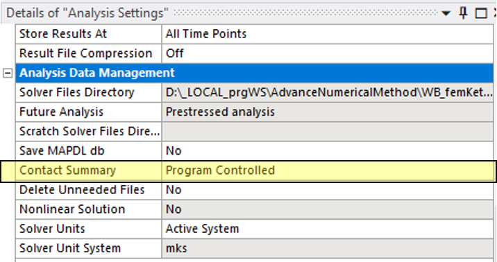{: width="50%"}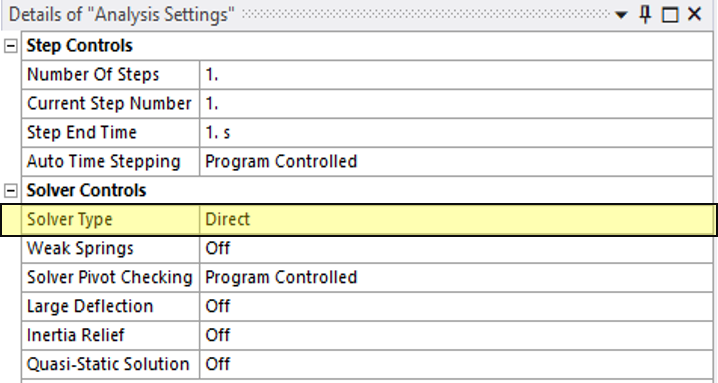{: width="50%"}

```fortran
!   Commands inserted into this file will be executed immediately after the ANSYS /POST1 command.
 
!   Active UNIT system in Workbench when this object was created:  Metric (m, kg, N, s, V, A)
!   NOTE:  Any data that requires units (such as mass) is assumed to be in the consistent solver unit system.
!                See Solving Units in the help system for more information.
 
!Print the Full stiffness matrix
*DMAT, KmatrixF, D, import, full, file.full, STIFF !fetching the full stiffness matrix from .FULL file
*PRINT,KmatrixF,Kdense.txt !converting the file obtained into .txt format
!print the sparse stiffness matrix
*SMAT, KmatrixS, D, import, full, file.full, STIFF !fetching the sparse stiffness matrix from .FULL file
*PRINT,KmatrixS,Ksparse.txt
!print the nodal force matrix
*DMAT, FmatrixF, D, import, full, file.full, RHS !fetching the full force matrix from .FULL file
*PRINT,FmatrixF,FmatrixF.txt
 
!Get the total number of elements
 
*DO, i, 1, 6
    *DMAT, KMatrixEBuffer, D, IMPORT, EMAT, 'file.emat', STIFF, i
    *PRINT, KMatrixEBuffer, KMatrixE.txt     ! Print to the appended file (no filename specified)
*ENDDO
 
!Print the Full mass matrix
*DMAT, MmatrixF, D, import, full, file.full, MASS !fetching the full mass matrix from .FULL file
*PRINT,MmatrixF,Mdense.txt
!print the sparse mass matrix
*SMAT, MmatrixS, D, import, full, file.full, MASS !fetching the sparse mass matrix from .FULL file
*PRINT,MmatrixS,Msparse.txt
```

# ANNEX E. Kết quả ngoại suy – Full integration
 
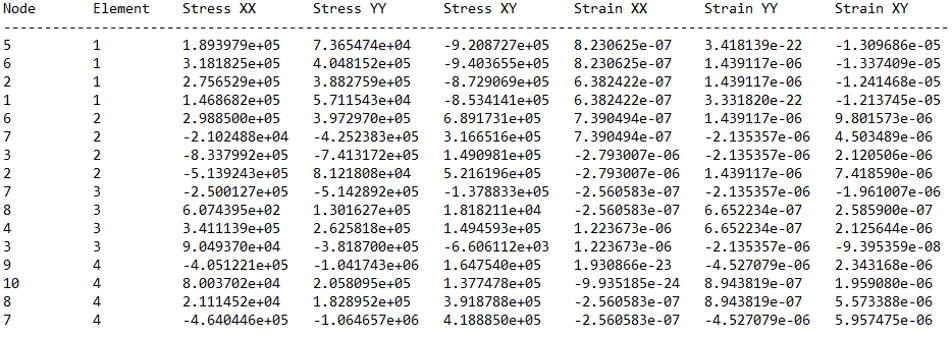